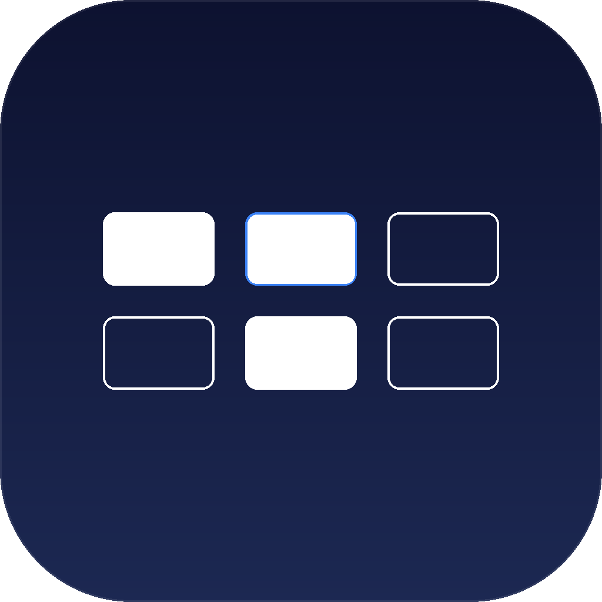
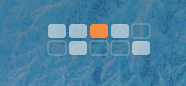

#  SpacesGrid

A compact macOS menu-bar application that shows all of your Mission Control
Spaces as a tiny, configurable grid. Spaces with open windows are highlighted;
your currently active Space is shown in your accent color. KDE Plasma ships a
similar Pager widget — SpacesGrid brings the same idea to macOS.

> **Disclaimer:** I'm not a Swift developer — this project was built entirely
> with [Claude Code](https://claude.ai). I wanted to bring a useful
> tool from KDE Plasma to macOS, so I used AI to make it happen. Contributions
> from experienced Swift/macOS developers to improve the code are very welcome.



## Features

- Compact N × M grid — configurable from 1 × 1 up to 12 × 6
- Three distinct visual states: **active** / **occupied** / **empty**
- Fullscreen and Stage Manager space indicator (small badge)
- Full colour customisation for every state
- Adjustable cell size, gap, corner radius, and border width
- Configurable window-refresh interval (0.5 s – 10 s)
- Launch at login via the native `SMAppService` API (macOS 13+)
- Responds instantly to Space switches with zero perceptible lag
- Zero third-party dependencies — plain Swift, AppKit, and SwiftUI
- No Dock icon, no sandbox restrictions, no App Store required

## Requirements

| Component | Minimum |
|---|---|
| macOS | 13.0 Ventura |
| Architecture | Apple Silicon (arm64) **or** Intel (x86\_64) |
| Xcode Command Line Tools | 15.0 or later |

Install the Xcode Command Line Tools if you have not already done so:

```bash
xcode-select --install
```

## Installation

### Option 1 — Download the DMG (easiest)

Go to the [**Releases**](https://github.com/euxhenh/SpacesGrid/releases/latest)
page, download `SpacesGrid-<version>.dmg`, open it, and drag **SpacesGrid.app**
to your **Applications** folder.

> **Gatekeeper notice:** The app is ad-hoc signed but not notarized with an
> Apple Developer ID. On first launch, macOS will block it with a warning.
> To open it anyway, **right-click → Open** and confirm in the dialog.
> Alternatively, run once in Terminal:
> ```bash
> xattr -cr /Applications/SpacesGrid.app
> ```

### Option 2 — Build from source

Requires Xcode Command Line Tools 15+ (`xcode-select --install`).

```bash
git clone https://github.com/euxhenh/SpacesGrid.git
cd SpacesGrid
bash build.sh
open build/SpacesGrid.app
```

**Useful Makefile targets:**

```
make              # build for the native architecture
make run          # build and open immediately
make install      # build and copy to /Applications
make universal    # build a universal arm64 + x86_64 binary
make dmg          # package build/ into a distributable DMG
make clean        # remove the build/ directory
```

### Launch at login

Right-click the grid → **Preferences…** → **Behaviour** tab → toggle
**Launch at login**. No helper bundle required — this uses Apple's native
`SMAppService` API. You can also add it to
**System Settings → General → Login Items**.

## Permissions

On **macOS 14 Sonoma and later**, SpacesGrid requires **Screen Recording**
permission to read the window list of other applications. Without it, all
spaces will appear empty (no windows detected).

Grant access via:

> System Settings → Privacy & Security → Screen Recording → SpacesGrid

The system will prompt you automatically the first time you launch the app.

## Usage

SpacesGrid lives entirely in the menu bar — there is no Dock icon or main window.

| Action | Result |
|---|---|
| Glance at the grid | See which Spaces are active / occupied / empty |
| Right-click the grid | Open the context menu |
| **Preferences…** (or `⌘ ,`) | Open the full Preferences window |
| **Quit SpacesGrid** | Exit the app |

### Visual key

| Cell style | Meaning |
|---|---|
| Solid accent fill | Currently active Space |
| Solid custom fill | Space has at least one open window |
| Outline only | Space is empty |
| Small badge in corner | Fullscreen or Stage Manager Space |

## Configuration

All settings are persisted immediately to
`~/Library/Preferences/com.local.SpacesGrid.plist` and take effect without
restarting the app. Open the Preferences window via **right-click → Preferences…**

### Appearance

| Setting | Range | Default |
|---|---|---|
| Active space colour | any colour + opacity | system accent colour |
| Occupied space colour | any colour + opacity | white 55% |
| Empty space border colour | any colour + opacity | white 22% |
| Border width | 0.25 – 4 pt | 0.75 pt |
| Corner radius | 0 – 8 pt | 1.5 pt |

### Grid

| Setting | Range | Default |
|---|---|---|
| Columns | 1 – 12 | 5 |
| Rows | 1 – 6 | 2 |
| Cell width | 6 – 24 pt | 9 pt |
| Cell height | 4 – 16 pt | 6 pt |
| Cell gap | 0 – 6 pt | 1.5 pt |

### Behaviour

| Setting | Options | Default |
|---|---|---|
| Refresh interval | 0.5 / 1 / 2 / 5 / 10 s | 2 s |
| Fullscreen indicator | on / off | on |
| Launch at login | on / off | off |

## How it works

SpacesGrid uses a small set of **private CoreGraphics Services (CGS) APIs**
that have been stable across macOS 10.x – 15.x. These are the same APIs used
by popular utilities such as WhichSpace, Mosaic, and Spaces Bar.

| Private function | Purpose |
|---|---|
| `CGSMainConnectionID()` | Obtain the per-process CGS connection handle |
| `CGSGetActiveSpace(cid)` | ID of the currently focused Space |
| `CGSCopyManagedDisplaySpaces(cid)` | Ordered list of every Space on every display |
| `CGSCopySpacesForWindows(cid, mask, wids)` | Which Spaces contain the given window IDs |

Window occupancy is determined by cross-referencing
`CGWindowListCopyWindowInfo` (public API, layer-0 windows only) with
`CGSCopySpacesForWindows`. No Accessibility permission is required.

All private API declarations are isolated in
[`Sources/CGSPrivate.swift`](Sources/CGSPrivate.swift) with documentation
comments explaining each parameter.

## Project structure

```
SpacesGrid/
├── Sources/
│   ├── main.swift              # NSApplication entry point
│   ├── CGSPrivate.swift        # Private CGS API declarations
│   ├── Preferences.swift       # ObservableObject settings store (UserDefaults)
│   ├── PreferencesView.swift   # SwiftUI preferences window (3 tabs)
│   ├── SpacesManager.swift     # Space + window-occupancy detection
│   ├── GridView.swift          # NSView that draws the grid
│   └── AppDelegate.swift       # NSStatusItem setup, polling, notifications
├── Resources/
│   └── Info.plist              # Bundle metadata (LSUIElement = true)
├── assets/                     # Screenshots and marketing images
├── build.sh                    # Compile + package + codesign script
├── Makefile                    # Convenience wrappers around build.sh
└── .github/
    ├── workflows/ci.yml        # GitHub Actions build check
    └── ISSUE_TEMPLATE/         # Bug report and feature request templates
```

## Contributing

Contributions are very welcome — see [CONTRIBUTING.md](CONTRIBUTING.md) for
full guidelines. In short:

1. Fork the repository
2. Create a feature branch (`git checkout -b feature/my-thing`)
3. Make your changes, run `bash build.sh` to verify they compile
4. Open a pull request with a clear description

## License

[MIT](LICENSE) © 2026 Euxhen Hasanaj
